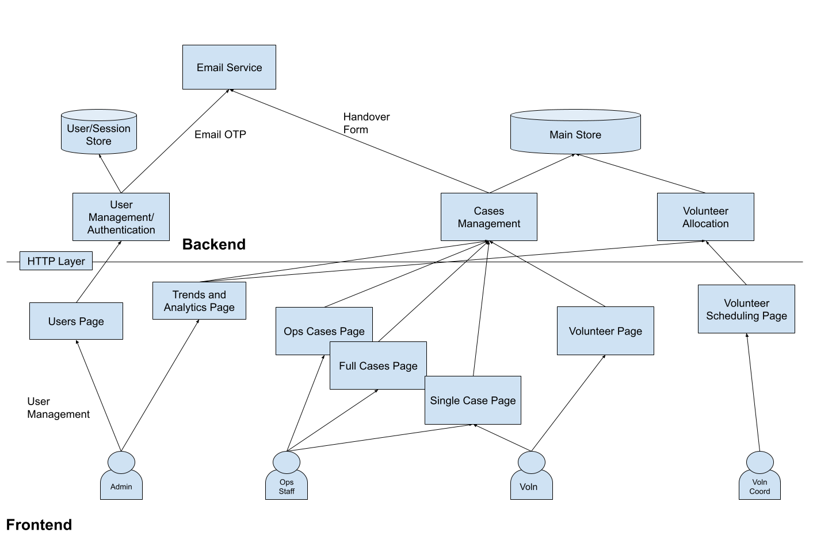

# Product Requirements Document
This Product Requirements Document outlines the ACRES Wildlife Management Platform: a unified system designed to replace operational friction with a single source of truth. By digitizing the end-to-end lifecycle from initial triage to final release, the platform empowers staff and volunteers to spend less time wrestling with data and focus on their assigned duties.

## System Overview

## Roles
Admin
- Full CRUD (Create, Read, Update, Delete) permissions across all tables, including user management and session revocation.
Operations/Call Centre Staff
- Can view Active/Historic cases for volunteer dispatch management
Volunteer
- Access focuses only on cases for assigned field duties.
- Volunteers will require a responsive mobile interface for field duties
Volunteer Coordinator
- Focuses on Volunteer management

## Backend Components

The backend will utilize a cloud-based, modular architecture to ensure scalability.

Database (Supabase/PostgreSQL): A relational database to maintain the "single source of truth"

Storage (Image/Media Database): Bucket storage for high-resolution photos, videos, and documents for SOP and 

Role-Based Authentication (BetterAuth & Email OTP): Secure, passwordless entry using Email OTP to acquire access tokens for the database.

API Layer: The database will be exposed through a HTTP-based API for frontend components.

## Database Structure and Fields

The following schema defines the PostgreSQL tables required for the ACRES Wildlife Management Platform backend.

### 1. User Profiles

Stores credentials and role-based access control (RBAC) data to ensure secure authentication and authorization.

* **Name**: *Text*. Full name of the staff member or volunteer.
* **Email**: *Text*. Identifier used for Email OTP login via the BetterAuth library.
* **Role**: *Enum*. Defines system permissions (Volunteer, Admin, Call Staffer, Vet).
* **Access Expiry**: *Timestamp*. Date and time when the user's account access is set to expire.
* **Date of Login**: *Timestamp*. Tracks the last successful OTP Authentication login.

### 2. Cases

The central table for documenting the lifecycle of a wildlife incident from initial triage to final outcome.

* **Caller Name**: *Text*. Name of the individual reporting the wildlife incident.
* **Caller's Number**: *Text*. Contact number of the caller; subject to automated deletion after 30 days for cases not marked active.
* **Date of Rescue**: *Date*. The specific date the rescue team was dispatched or the animal was secured.
* **Time of Call**: *Time*. Precise timestamp of the incoming report for operational tracking.
* **Location of Call**: *Text*. General area or address provided by the caller.
* **GPS Location of Call**: *Coordinates*. General area or address provided by the caller.
* **Location of Encounter**: *Text*. General area or address where animal was initially found.
* **GPS Location of Encounter**: *Coordinates*. General area or address where animal was initially found.
* **Taxonomy**: *Text*. Biological classification (Mammal/Lizard) used for structured reporting.
* **Species**: *Text*. Specific common or scientific name of the animal involved.
* **Case Info**: *Text*. Description of the general situation or distress reported by the caller.
* **Additional Info**: *Text*. Supplementary notes for staff and field teams.
* **Priority**: *Enum*. Urgency level. Values: **Urgent/Get Updates/Call before going/Contained, ACRES to pickup/Sending to us/For Reunion**
* **Action Taken**: *Enum*. Initial incident conclusion. Values: **Pending/Advised Only/Visit Only/Rescued/Dead On Arrival/Errand Completed/Domestic**
* **Assigned Volunteer**: *UUID[]*. Array of Foreign Keys of users assigned to the rescue mission.
* **Driver Name**: *Text*. Name of the staff or volunteer operating the rescue vehicle.
* **Action Conclusion**: *Text*. Detailed summary of the final actions taken on-site.
* **Completed At**: *Timestamp*. Date and time the rescue operation was officially finalized. Can Automatically be generated.
* **Released At**: *Timestamp*. Date and time the animal was returned to the wild.
* **Status**: *Enum*. Current state of the animal **Released/Died/Not in View/NParks/NCS/Euthanised/ACRES/Mandai/No Action Required/Adopted**.
* **Created By**: *UUID*. Foreign key linking to the User Profile of the staffer who logged the call.
* **Takeover Form**: *File*. Digital document containing the mobile-captured signature of the person handing over the animal.
* **Caller Email**: *Text*. Contact email captured specifically via the digital takeover form.
* **Images**: *UUID[]*. Array of foreign keys linking to the Media table for rescue and release photos.

### 3. Media

Centralized repository for images and auditory assets.

* **Field Support Documents**: *File*. Digital files for species identification and SOPs.
* **Animal Vocalizations**: *Audio File*. Sound references used by field teams for identification.
* **Images**: *Image File*. Photos of animals used for identification and report creation.
* **Vet Care Sheets**: *File*. Clinical records animals under care.

### 4. Species & Facilities

Reference tables to ensure data consistency across the platform.

**Species Table**

* **Species Name**: *Text (Unique)*.
* **Taxonomy**: *Text*.

**Facility Capacity Table**

* **Name**: *Text*. Specific area within ACRES.
* **Capacity**: *Integer*. Maximum number of animals the facility can house.
* **Occupied**: *Integer*. Current number of animals residing in the facility.

### 5. Volunteer Timetable

Enables the Volunteer Coordinator to manage schedules and dispatching.

* **Time Slot**: *Interval*. Scheduled period for the volunteer shift.
* **Volunteer**: *UUID*. Foreign key linking to a specific User Profile.
* **Notes**: *Text*. Specific notes or availability details for the shift.

## Frontend Components
The frontend will be built using the React framework.

### Call Centre Home Page
Analogous to the original call logging system frontend and will be the landing page for ops/call centre users. It is intended to show the staff brief information about active cases at-a-glance.

The home page will consists of a dashboard with the following information:
- Total Capacity
    - The total capacity can also be edited from this component
- Total Animals in captivity
- Total Active Calls
- Total Cases pending input
- Names of Current Field Staff (allocated by volunteer coordinator)

The home page will also contain the Table of active cases only. The table will consist of the following fields only:
- **Caller Name**
- **Caller's Number**
- **Location of Call**
* **Case Info** 
- **Species**
- **Priority** with colour indicator

Each row of the table will navigate to it's case's corresponding **Single Case View**

### Volunteer Home Page
The home page will contain the Table of case(s) assigned to that volunteer only. The table will consist of the following fields only:
- **Caller's Number**
- **Location of Call**
- **Case Info**

### Full Cases View

The Full Cases View represents the table view of all existing cases for staff to look through historical records. It is available to:
- Admin users who can see all historical cases.
- Ops staff who can see the past 1 month of cases. The Cases page is also navigable to from the Call Centre Home Page to refer to completed cases

The table will consist of the following fields:
* **Caller Name**
* **Caller's Number**
* **Date of Rescue**
* **Location of Call**
* **Species**
* **Taxonomy**
* **Priority**
* **Case Info** 
* **Additional Info**

**Date Filter**:
This component allows users to narrow down the table view to a specific timeframe.

Users can select a "Start Date" and "End Date" to view cases within that period.

**Row Filters**:
The table will include dynamic row filters to isolate specific case types.

* **Status Filter**: Allows users to filter by current animal status (e.g., "Released", "Euthanised", "Mandai").
* **Species/Taxonomy Filter**: A searchable dropdown to view cases involving specific animal groups.
* **Priority Filter**: Isolates cases by priority level.

### Single Case View
The Case view will show all information that the respective role has access to. it is meant to show more detailed information about the case that is not important to the table.

For Ops Staff, all fields will be shown.

Ops staff can also change the assigned volunteer which will make it available for that volunteer to view in the **Volunteer Home Page**

For Volunteers, The following info will be shown.
* **Caller Name**
* **Caller's Number**
* **Date of Rescue**
* **Time of Call**
* **Location of Call**
* **GPS Location of Call**
* **Location of Encounter**
* **GPS Location of Encounter**
* **Taxonomy** (editable)
* **Species** (editable)
* **Case Info** 
* **Additional Info** (editable)
* **Status** (editable)
* **Images** ordered by date

The page will also contain a link to the **takeover form** page for that case for staff/volunteers to access

The page will also contain a link to the **resource portal** page

### Takeover Form Page

The Takeover Form page is a mobile-optimized interface designed for field volunteers to facilitate the legal transfer of wildlife from a caller to ACRES. This digital document serves as the official record of custody transfer.

The page will display the following information and input fields:

* **Case Reference**: Non-editable display of the unique Case Number and Species to ensure the form is linked to the correct record.
* **Legal Terms and Conditions**: A clear section outlining the legal terms of the animal takeover. Text will be provided by ACRES legal counsel.
* **Signature Field**: A digital signature pad allowing the caller to sign directly on the volunteer's phone using a finger or stylus.
* **Email Notification Field**: a checkbox 
* **Caller Email**: An optional text field for the caller to enter their email address; this data is specifically captured at this stage for the handover record.
* **Submit Action**: A button that, upon submission, attached the signature to the to the Case record, and triggers an automated email notification to the caller.

### Resource Portal Page

The Resource Portal serves as an integrated library to support field operations. It is designed for quick navigation on mobile devices to assist volunteers in real-time decision-making.

The portal will consist of the following sections, represented on the sidebar on the page:
* **Identification Guides**: Image of Singapore wildife
* **Vocalization Library**: Audio files of animal calls
* **Standard Operating Procedures (SOPs)**: Access to internal guidelines for safe handling and specific rescue protocols.

### User Management Page

The User Management page is an administrative interface designed for the **Admin** and **Volunteer Coordinator** roles to oversee the platform's user base and ensure secure access. It serves as the primary tool for managing role-based access control (RBAC) and maintaining the integrity of the volunteer and staff database.

The page will consist of a **User Directory Table** with the following fields and actions:

* **Name**: Display name of the staff member or volunteer.
* **Email**: The unique identifier used for system authentication.
* **Role**: Displays the assigned permission level (e.g., Volunteer, Admin, Call Staffer).
* **Access Status**: A visual indicator showing if the account is currently active or if access has expired.
* **Edit User**: Link to the individual User Page for detailed profile management.

### User Page

The User Page provides a granular view of a specific individual's profile. This page is accessed by **Admins** to modify credentials.

The page is organized into the following sections:

#### **Profile Information**

* **Full Name**: Editable text field for the user's legal name.
* **Email Address**: Primary contact and login email.

#### **Access & Permissions**

* **Assigned Role**: A dropdown menu to select or change the user's RBAC level (Volunteer, Admin, Call Staffer, or Volunteer Coordinator).
* **Access Expiry Date**: A date picker to set when the user’s platform access will automatically terminate.
* **Account Status**: A toggle to manually enable or disable the account.

### Volunteer Management

The central application that will be used by the volunteer coordinator which aims to:
- Manage the allocation of volunteer shifts
- Track volunteer hours for data-informed decision making

#### Frontend
The volunteer duty roster frontend will be modeled using a **calendar-like** interface. Each day will have the option to select the volunteer for each shift via a dropdown. Each change updates the volunteer timetable.

The front page will also have a table to count the hours allocated to each volunteer to maintain fairness

Support for CSV upload: to allow integration with other duty planning mechanisms (like Excel), there will be an option to import dates using a formatted string. the imported schedule will replace existing slots

### Call and Incident Trend Page
The purpose of the Trends and Analytics page is to display overall statistics for decision making

Possible tatistics that can be displayed: Number of Active Cases, Facility Capacity, Average time to Complete a call, Most common species rescued.

Statistics over Time-adjustable period: The time range of the data source can be adjusted to: 1 month, 3 months, 1 year, or a custom date range

## Security Requirements

### User Authentication
The platform will implement a secure, passwordless authentication system to ensure ease of access for field volunteers while maintaining high security standards for sensitive data across the different security roles in the organisation. The implementation follows the flow outlined in [ACRES User Authentication Design v1.1](https://docs.google.com/document/d/10gS_BQqDMkxfe8_3Y1wx58uxz0JEeaZY) 

BetterAuth Integration: The platform will utilize the `betterauth` library to maintain a standardized authentication flow and session states.

Email OTP (One-Time Password): Users will authenticate by entering their registered email and receiving a unique, time-sensitive code via the Email API.

Upon successful completion of the OTP flow, the backend will issue JSON Web Tokens (JWT) or session tokens that encode the user’s specific role (e.g., Admin, Volunteer).

The JWT token will act as the "key" for the central database, ensuring that API requests only return data the user is authorized to see.

### Data Security and Permissions Matrix

Access will be controlled at the **Table**, **Row**, and **Column** levels to ensure that users with different roles only interact with data essential to their specific role.

#### 1. Admin

* **Table-Level Access**: Full CRUD (Create, Read, Update, Delete) permissions across all database tables, including User Profiles, Cases, Media, and Facilities.
* **Row-Level Access**: Can view and manage all historical and active records without restriction.
* **Column-Level Access**: Can view and manage all fields, including sensitive PII (Personally Identifiable Information) like caller phone numbers and internal audit logs.
* **Administrative Actions**: Can manage user accounts, assign roles, and revoke active sessions for security enforcement.

#### 2. Operations / Call Centre Staff

* **Table-Level Access**: Primary access to the **Cases** and **Facility Capacity** tables.
* **Row-Level Access**: Limited to "Active" cases and historical records from the past **1 month** only. 
* **Column-Level Access**: Can view all fields required for dispatch, including **Caller Name**, **Phone Number**, and **Location**.

#### 3. Volunteer

* **Table-Level Access**: Can access the **Cases** table and the **Field Resource Portal**.
* **Row-Level Access**: Strictly limited to cases where the user's ID is present in the **Assigned Volunteer** field.
* **Column-Level Access**: Cannot view any cases or associated phone numbers for incidents older than **1 month**.
* **Feature Access**: Can access the **Takeover Form** and **Media Upload** tools for their specific assigned cases only.

#### 4. Volunteer Coordinator

* **Table-Level Access**: Authorized to view the **User Profiles** table and the **Volunteer Timetable** only.
* **Row-Level Access**: Can view all volunteer profiles and all entries within the scheduling system.
* **Column-Level Access**: Can view and edit shift details, volunteer availability, and contact information.

Permissions Matrix

| Feature / Table | Admin | Ops Staff | Volunteer | Vol. Coordinator |
| --- | --- | --- | --- | --- |
| **User Management** | Full CRUD | No Access | No Access | View Only |
| **Active Cases** | All Cases | All Cases | **Assigned Only** | No Access |
| **Active Cases (Rows)** | Full History | **< 1 Month** | **< 1 Month** | No Access |
| **Phone Numbers** | Always Visible | Always Visible | **< 1 Month** | No Access |
| **Facility Capacity** | Edit | Edit | No Access | No Access |
| **Timetable** | View Only | View Only | No Access | **Full Edit** |

## Data Privacy Requirements

To comply with the PDPA, the platform implements a specific workflow for handling Phone numbers which are personally identifiable. This functionality focuses on the removal of sensitive contact data once it is no longer operationally necessary.

Old Data Deletion (Manual Override)
The system provides a mechanism for authorized personnel to purge sensitive caller information while maintaining the integrity of the clinical and operational rescue record.

This functionality is strictly limited to the Admin role.

Contextual Trigger: The option to delete is only available to Admin Roles in the frontend when viewing cases in the Case View.

Time-Based Condition: The deletion option is only to delete cases that are older than 1 month from the "Date of Call" field.

## Additional Features

### GPS Coordinate Export

Users can export the coordinates of encountered locations into a serialized format which can be used to create charts using 3rd party applications like MyMaps

This action is located in the Cases Page.

Exported in the [KMZ](https://developers.google.com/kml/documentation/kmzarchives) format which represents the locations as geographic coordinates

### CSV Export
Users can export the coordinates of encountered locations into a serialized format which can be used to create charts using 3rd party applications like MyMaps

This action is located in the Cases Page.

The user can export the fields: time of rescue, location of rescue, status of animal, image of animal for the creation of NParks report

## Source Control Convention
The scource control software used will be Git. The platform repo will be hosted on GitHub.

- production: development branch with real 
- development: completed features will be merged into this branch first for integration testing
- features: Modular features to be worked on separately

Adopt a resolve features locally, fast-forward remote merging only approach for integrating features into `development`
- `pull` the latest development branch
- `merge` the development branch into the feature branch locally and resolve conflicts accordingly 
- `push` the feature branch to GitHub and mark it as a PR

